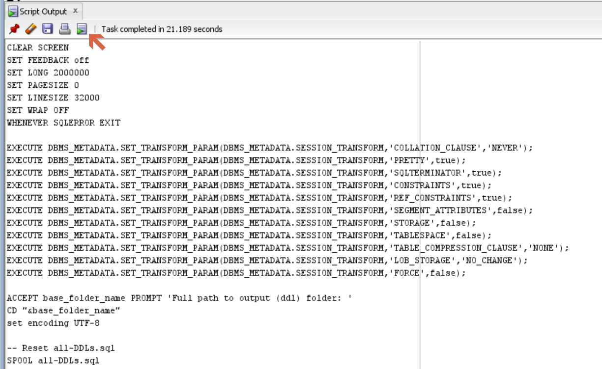
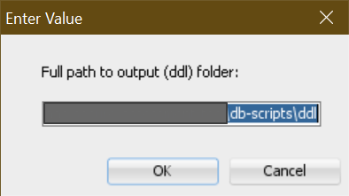

# DDL Extract Generator Utility

## Overview

This utility is used for extracting the full DDL objects from the database schema to an output folder.

## Usage

Execute `ddl-extract-generator.sql` as the application schema user.

The output of this script is another script that you can run in SQL Developer or SQLPlus.

From SQL Developer, you can run the script output by clicking on the _Run Script Output as a Script_ button.

The secondary script will prompt for the location of the output folder. Enter the full path to the `ddl` folder.

Prior to running the secondary script, the output folder must already have the following folders created:

- tables
- views
